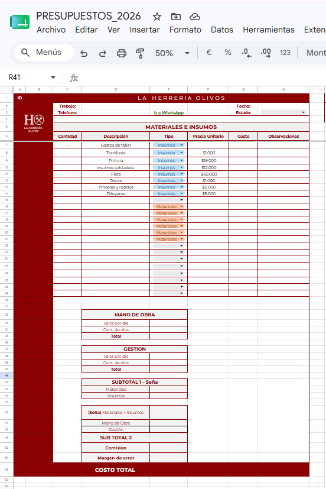
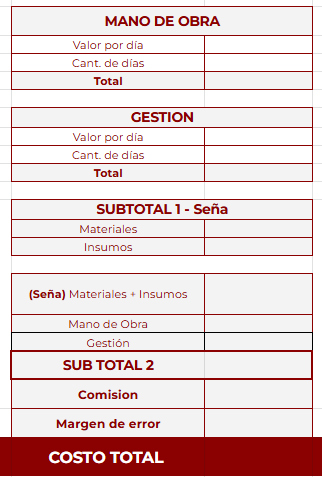
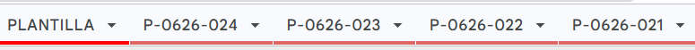
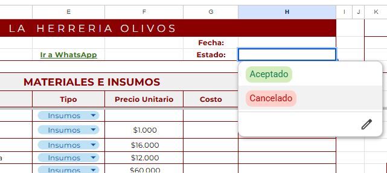
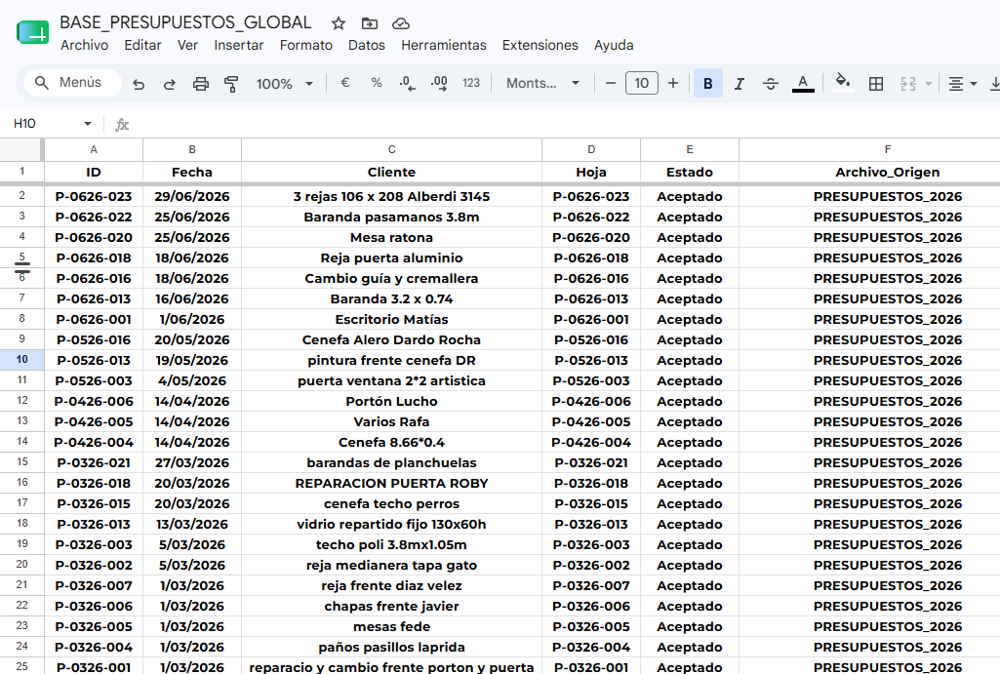
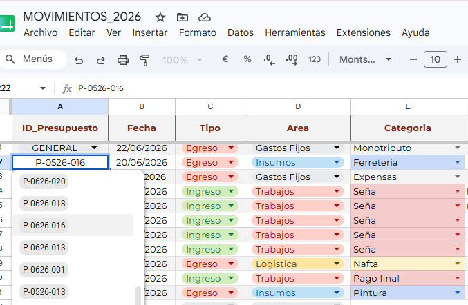
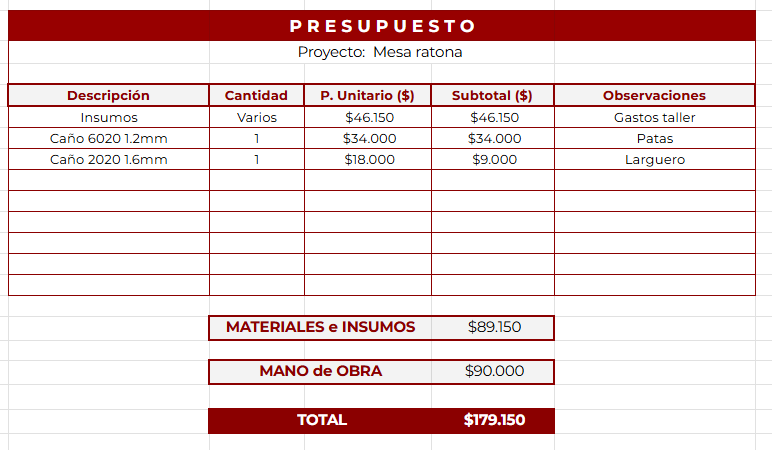
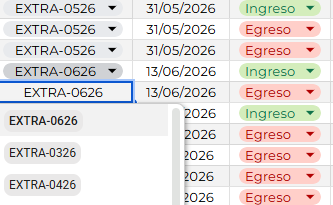
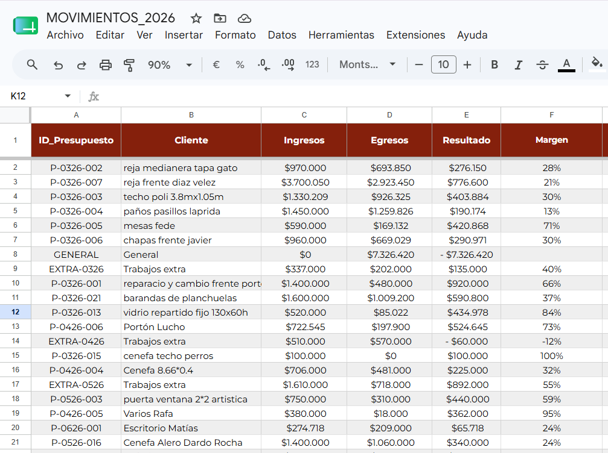
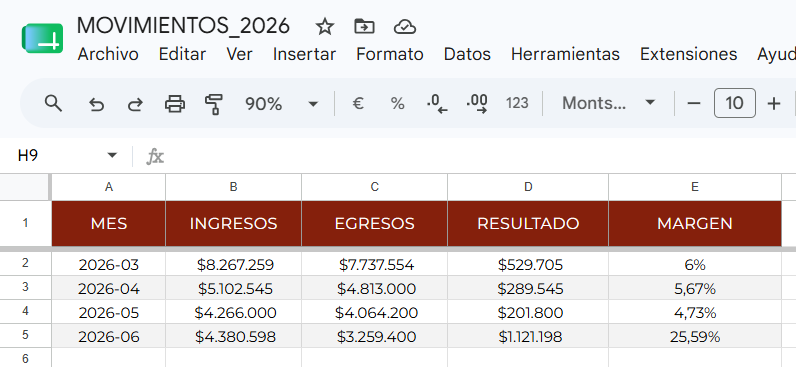

# Sistema automatizado de presupuestos para herrería

## Descripción

Previamente, la elaboración de presupuestos se realizaba en múltiples planillas de Excel, lo que dificultaba el seguimiento de los trabajos aceptados y requería realizar tareas manuales repetitivas. 

Para optimizar este proceso, se desarrolló un sistema en Google Sheets con Apps Script que centraliza la información y automatiza las principales tareas.

El sistema permite generar presupuestos, asignar IDs automáticos, unificar los trabajos aceptados en una base global y asi poder registrar ingresos y egresos, calcular costos y hacer seguimiento de cada trabajo.

## Funcionamiento
  
- Generación automática de presupuestos a partir de una plantilla.
- Asignación automática de un ID para cada presupuesto.
- Cálculo automático de materiales, insumos, mano de obra, márgenes y total del presupuesto.
- Cambio de estado del presupuesto (aceptado o cancelado).
- Registro automático de los presupuestos aceptados en una base de datos global.
- Los ID de los presupuestos aceptados pasan a estar disponibles para seleccionarlos desde la planilla de Movimientos.
- Registro de ingresos y egresos asociados a cada trabajo.
- Seguimiento de costos, rentabilidad y resultado de cada trabajo.

## Capturas del proyecto

### Plantilla de presupuesto

- Plantilla utilizada para crear nuevos presupuestos. Incluye fórmulas, listas desplegables y campos predefinidos para agilizar la carga de información.

### Cálculos del presupuestos

- Calculos de materiales, insumos, mano de obra, gestión y costo total del presupuesto.

### Presupuesto generado

- Cada presupuesto se crea a partir de la plantilla y recibe un ID único.

### Cambio de estado

- El estado del presupuesto puede actualizarse mediante una lista desplegable.

### Base global

- Los datos de los presupuestos aceptados pasan a una base global centralizando la información.

### Registro de Movimientos

- Los ID de los presupuestos aceptados quedan disponibles en una lista desplegable para registrar los ingresos y egresos asociados a cada trabajo.

### Vista para el cliente

- Vista previa del presupuesto para compartir con el cliente.

### Trabajos extra

- El sistema permite registrar ingresos y egresos de trabajos extra mensuales que no están asociados a ningun ID de presupuesto.

### Resultado por trabajo

### Resumen mensual

 

